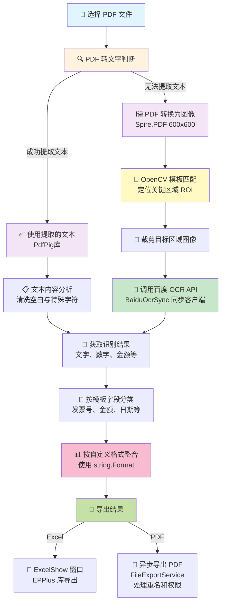

# 发票处理程序

一个基于 .NET 8 WinForms 的 PDF 发票自动识别与处理系统，使用百度 OCR 进行文字识别、模板匹配与批量导出。

## 功能特性

- 📄 **PDF 批量处理**：支持选择文件夹并批量识别 PDF 文件
- 🤖 **OCR 识别**：集成百度 OCR API，自动识别发票内容
- 📋 **模板管理**：灵活的模板系统，支持多种发票类型分类，
- 🔄 **批量导出**：将识别结果导出为 Excel 和 PDF 格式
- 🛡️ **安全可靠**：参数化 API 密钥管理，异步非阻塞操作

## 系统需求

- .NET 8.0 或更高版本
- Windows 7.0+ (WinForms 支持)
- 百度 OCR API 账号 (AppID 和 API Key)

## 快速开始

### 1. 配置 API 密钥

在运行程序前，设置百度 OCR 的 API 密钥。有两种方式：

**方式 A：环境变量（推荐用于生产环境）**
```bash
# Windows PowerShell
[Environment]::SetEnvironmentVariable("BAIDU_API_KEY", "your_api_key", "User")
[Environment]::SetEnvironmentVariable("BAIDU_SECRET_KEY", "your_secret_key", "User")

# 或在 Windows 命令提示符
setx BAIDU_API_KEY "your_api_key"
setx BAIDU_SECRET_KEY "your_secret_key"
```

**方式 B：运行时输入（用于测试）**
- 启动程序后，在 textBox3 和 textBox4 中输入 API Key 和 Secret Key
- 点击"开始识别"按钮时会自动验证和初始化

### 2. 准备模板

1. 在程序目录下创建 `Templates` 文件夹
2. 在 `Templates` 下创建各种发票类型的子文件夹（如 `增值税发票`, `普通发票`)
3. 在每个子文件夹中放置：
   - 模板图片（`.png` 或 `.jpg`）
   - 模板配置文件 `{类型名}.json`

**模板 JSON 格式示例：**
```json
{
  "Templates": [
	{
	  "ClassName": "发票号",
	  "ImageFile": "template_invoice_number.png",
	  "ROI": "10,20,200,30"
	},
	{
	  "ClassName": "金额",
	  "ImageFile": "template_amount.png",
	  "ROI": "50,100,300,50"
	}
  ]
}
```

**ROI 格式说明：** `X,Y,Width,Height`
- `X`: 裁剪区域距离左边的距离（像素）
- `Y`: 裁剪区域距离顶部的距离（像素）
- `Width`: 裁剪区域的宽度（像素）
- `Height`: 裁剪区域的高度（像素）

### 配置文件格式

程序在 `Templates` 目录下使用两个配置文件定义输出格式：

#### 📄 Congfig.txt - Excel 输出格式配置

存储位置：`Templates/Congfig.txt`

**格式说明：**
```
分类名:格式字符串
分类名:格式字符串
```

**示例内容：**
```
增值税发票:{0}_{1}_{2}
普通发票:{0}-{1}
专票:{0}_{1}_{2}_{3}
```

**说明：**
- 左侧 = 分类名称（必须与 Templates 下的子文件夹名相同）
- 右侧 = 输出格式（使用 `{0}`、`{1}`、`{2}` 等占位符）
- `{0}` 代表模板中第 1 个字段、`{1}` 代表第 2 个字段，以此类推
- 占位符数量**必须**与该分类的 JSON 模板字段数匹配，否则报错

#### 📊 CongfigPDF.txt - PDF 输出文件名格式配置

存储位置：`Templates/CongfigPDF.txt`

**格式说明：**
```
分类名:格式字符串
分类名:格式字符串
```

**示例内容：**
```
增值税发票:发票_{0}_{1}_{2}
普通发票:收据_{0}-{1}
专票:专用_{0}_{1}_{2}_{3}
```

**说明：**
- 格式与 Excel 配置相同
- 定义导出 PDF 文件时的命名规则
- 最终文件名为 `{格式字符串}.pdf`

#### ✨ 格式配置示例与说明

**场景：识别增值税发票**

模板配置（增值税发票.json）：
```json
{
  "Templates": [
	{ "ClassName": "发票号", "ImageFile": "invoice_no.png", "ROI": "50,80,150,30" },
	{ "ClassName": "发票代码", "ImageFile": "code.png", "ROI": "50,150,200,30" },
	{ "ClassName": "总金额", "ImageFile": "amount.png", "ROI": "80,280,150,40" }
  ]
}
```

输出格式配置（Congfig.txt）：
```
类型1:{0}_{1}_{2}
类型2:{0}_{1}_{2}
```

OCR 识别结果：
- 字段 0：`10100001`（发票号）
- 字段 1：`BJ123456`（发票代码）
- 字段 2：`10000.00`（总金额）

最终 Excel 输出字符串：
```
10100001_BJ123456_10000.00
```

最终 PDF 文件名（来自 CongfigPDF.txt）：
```
发票_10100001_BJ123456_10000.00.pdf
```

### 配置文件自动生成

- 首次运行程序时，如果配置文件不存在，程序**不会自动创建**
- 需要**手动创建** `Congfig.txt` 和 `CongfigPDF.txt`
- 编辑分类时，可通过界面的"设置输出格式"按钮更新配置

### 3. 启动程序

```bash
dotnet run
```

## 工作流程与处理逻辑

### 处理流程图



### 核心流程说明

| 步骤 | 技术方案 | 输入 | 输出 |
|------|--------|------|------|
| **1. PDF 文字判断** | PdfPig + UglyToad | PDF 文件路径 | 提取的文本/失败标记 |
| **2. 文本清洗** | Regex 正则表达式 | 原始文本 | 清洁文本（去空白、特殊符号） |
| **3. PDF 转图像** | Spire.PDF | PDF 第一页 | Bitmap (600×600 DPI) |
| **4. 模板匹配** | OpenCV (C# 绑定) | 发票图像 + 模板图片 | ROI 坐标 (X, Y, W, H) |
| **5. 区域裁剪** | OpenCV CropImage | 原图 + ROI 坐标 | 目标区域 Bitmap |
| **6. OCR 识别** | 百度 OCR API | Base64 编码的图像 | JSON 结果 (文字数组) |
| **7. 字段提取** | JsonDocument 解析 | API 响应 JSON | 识别的文本内容 |
| **8. 格式整合** | string.Format | 字段列表 + 自定义格式 | 最终输出字符串 |
| **9. 批量导出** | EPPlus / FileExportService | 识别结果字典 | Excel 文件 / PDF 副本 |

## 使用指南

### 工作流程

1. **选择源文件夹**
   - 点击"浏览"按钮，选择包含 PDF 文件的目录
   - 程序会自动列出该目录下的所有 PDF 文件

2. **选择导出目录**
   - 点击"浏览"按钮选择导出结果的目标目录

3. **输入 API 密钥**
   - 在 textBox3 输入百度 API Key
   - 在 textBox4 输入百度 API Secret

4. **编辑分类**
   - 点击"编辑分类"管理发票类型（添加、重命名、删除）
   - 为每个分类配置 Excel 输出格式（如 `{0}_{1}_{2}` 表示三个字段）

5. **开始识别**
   - 点击"开始识别"开始批量处理
   - 程序会根据模板自动匹配和识别内容

6. **导出结果**
   - 点击"导出 PDF"异步导出识别结果到目标目录
   - 自动处理重名文件（添加递增序号）
   - 点击"导出 Excel"导出识别数据到 Excel 文件

## 项目架构

### 服务层 (Services/)

#### OcrService
```csharp
// 封装百度 OCR 客户端，提供简单接口
public class OcrService
{
	public string Recognize(Bitmap bitmap);
}
```

#### TemplateService
```csharp
// 负责模板加载和解析
public class TemplateService
{
	public Dictionary<string, List<TemplateItem>> LoadAll();
}
```

#### FileExportService
```csharp
// 安全的文件导出（处理重名、非法文件名、异常）
public class FileExportService
{
	public (int success, int failed) CopyFiles(
		Dictionary<string, string> sourceToName, 
		string destDir, 
		bool overwrite = false);
}
```

### 核心类

- **Form1.cs**：主界面，协调各服务完成业务流程
- **OCR.cs**：百度 OCR API 同步调用（底层实现）
- **BaiduOcrSync**：同步 HTTP 客户端包装
- **OpterCV.cs**：OpenCV 图像处理（模板匹配、ROI 裁剪）
- **MakeModes.cs**：模板编辑窗口
- **ExcelShow.cs**：Excel 导出窗口

## 关键改进

### 安全性
- ✅ API 密钥优先从环境变量读取，避免硬编码
- ✅ 运行时验证输入参数，拒绝空值
- ✅ HTTP 响应状态检查，异常处理完善
- ✅ 文件名清洗，防止非法字符

### 性能
- ✅ 复用静态 HttpClient，避免资源泄漏
- ✅ Token 缓存机制，减少 API 调用
- ✅ 异步导出（async/await），不阻塞 UI
- ✅ OCR 实例缓存，仅在密钥改变时重新创建

### 可维护性
- ✅ 服务层独立，职责清晰
- ✅ 完整的 XML 文档注释
- ✅ 异常处理与用户友好提示
- ✅ 代码格式统一，易读易维护

## 已知限制与后续改进

### 当前限制
- OCR 识别使用同步调用，长流程可能阻塞 UI（已通过 Task.Run 异步导出缓解）
- Token 缓存未加锁，多线程并发可能重复请求
- 配置文件（Congfig.txt）格式简单，缺乏版本管理

### 建议的改进
- [ ] 将 OCR 识别改为完全异步（async/await）并显示进度条
- [ ] 为 Token 缓存添加并发保护（SemaphoreSlim/lock）
- [ ] 迁移配置到 appsettings.json 并支持热更新
- [ ] 集成 ILogger 日志框架，输出到文件
- [ ] 添加单元测试覆盖关键路径
- [ ] 性能分析，优化大批量（1000+ PDF）处理效率

## 依赖包

| 包名 | 版本 | 用途 |
|------|------|------|
| EPPlus | 8.5.4 | Excel 文件操作 |
| Newtonsoft.Json | 13.0.4 | JSON 序列化/反序列化 |
| OpenCvSharp4.Windows | 4.13.0 | 图像处理与模板匹配 |
| OpenCvSharp4.Extensions | 4.13.0 | OpenCV 扩展 |
| PdfPig | 0.1.14 | PDF 文本提取 |
| RestSharp | 106.15.0 | HTTP 客户端（可选） |
| Spire.PDF | 12.4.5 | PDF 转图像 |
| Tesseract | 5.2.0 | OCR（本地，当前未启用） |

## 故障排查

### "API Key 和 Secret 不能为空"
- 检查 textBox3 和 textBox4 是否正确输入
- 或确保环境变量 `BAIDU_API_KEY` 和 `BAIDU_SECRET_KEY` 已设置

### "未找到模板，请先配置模板分类"
- 确保 Templates 目录存在且包含子文件夹
- 验证每个分类目录下有对应的 JSON 配置文件

### 导出 PDF 时部分文件失败
- 检查源 PDF 文件是否被其他程序占用
- 检查目标目录是否有写入权限
- 查看失败统计（成功 X，失败 Y）

### OCR 识别结果为空或错误
- 验证百度 API 配额是否充足
- 检查 Token 是否过期（日志中查看"Token 获取成功"信息）
- 确保 PDF 质量足够清晰（模板匹配需要高质量图像）

## 许可证

MIT License

## 联系方式

如有问题或建议，请联系项目维护者。

---

**最后更新**：2025 年 4 月  
**版本**：1.0 (优化版)
